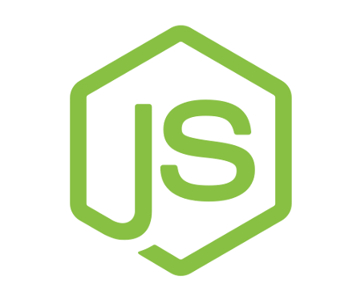

# RestCafe

This project is a REST API completely functional for a Cafe.

## Functionalities

- Send e-mails to verify users using nodemailer.
- Upload validated images using Cloudinary and express-fileupload.
- Auth users using JWT Authorization
- Auth users also using Google OAuth
- Upload data to cloud using MongoDB Atlas
- Complete CRUD for Users, Products and Categories
- Every route is INSANELY validated using express-validator

## Installation

1. Clone or download this repo
2. Run `npm install` to get all the dependencies of this project
3. Fill values on `example.env` and create a new one called just `.env`
4. Have fun and challenge yourself to improve this RESTServer

## About the Project

As it says, this project is a classic REST API with some interesting stuff such as connections to Cloudinary, Google OAuth and it uses nodemailer to send mails to users who want to register on our application. Is available to perform in every front-end you create (is also a personal project that I have).

This project runs on node.js and uses the unopinionated framework express.js.

This project is currently deployed on heroku

## Future achievements

- Dockerize the project
- Improve the SMTP functionality
- Deploy the project on AWS EC2

If you liked this, please give me a star. 🚀️

